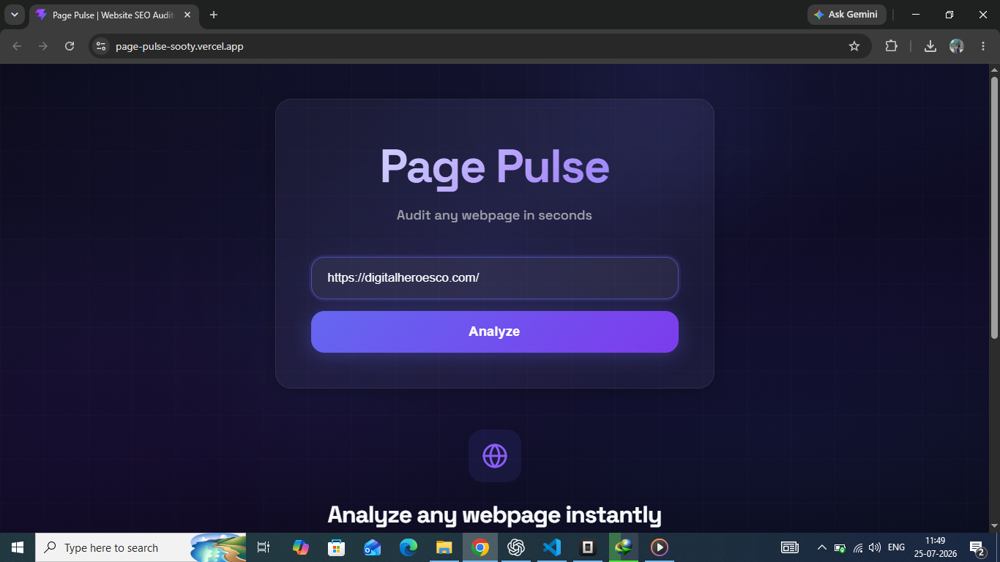
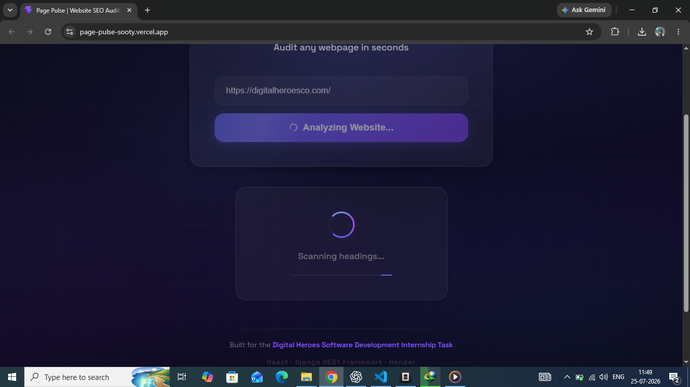
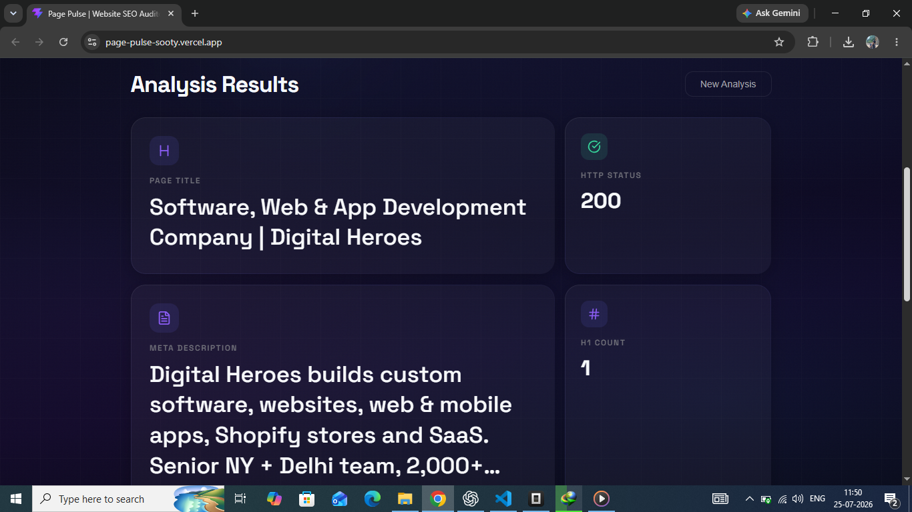
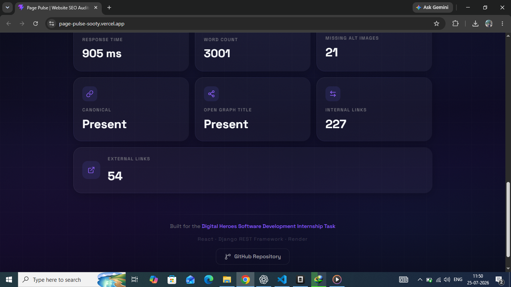

# 🚀 Page Pulse

> A modern web application that analyzes any webpage and generates a quick SEO overview by extracting key metadata, accessibility indicators, and page statistics.



---

## 🌐 Live Demo

**Frontend:** https://page-pulse-sooty.vercel.app/

**Backend API:** https://page-pulse-backend-g2ob.onrender.com

**GitHub Repository:** https://github.com/sumanyunayak/Page-Pulse

---

# 📖 Overview

Page Pulse is a full-stack web application built as part of the **Digital Heroes Software Development Internship Assignment**.

The application allows users to enter any valid webpage URL and instantly receive an SEO audit containing important metrics such as:

- HTTP Status
- Response Time
- Page Title
- Meta Description
- Heading Analysis
- Image Accessibility
- Canonical Tag
- Open Graph Title
- Internal Links
- External Links
- Word Count

The goal was to build a clean, responsive, production-ready application while emphasizing backend correctness, clean architecture, API design, and user experience.

---

# ✨ Features

- 🔍 Website SEO Analysis
- ⚡ Fast API Response
- 📄 Page Title Extraction
- 📝 Meta Description Detection
- 📑 H1 Tag Count
- 🖼 Missing Image Alt Detection
- 📊 Word Count
- 🔗 Internal & External Link Count
- 📌 Canonical Tag Detection
- 🌐 Open Graph Title Detection
- 🚫 Error Handling for Invalid URLs
- 📱 Fully Responsive Design
- 🎨 Modern Bento Grid Interface
- ✨ Smooth Loading Animations
- 🌌 Animated Background

---

# 📸 Screenshots

## Home


---

## Loading



---

## Results





---

# 🛠 Tech Stack

## Frontend

- React
- Vite
- Axios
- CSS
- Magic UI
- UIVerse
- Lucide React

## Backend

- Django
- Django REST Framework
- BeautifulSoup4
- Requests

## Deployment

- Vercel (Frontend)
- Render (Backend)

---

# 🏗 Project Structure

```
Page-Pulse
│
├── backend
│   ├── analyzer
│   ├── config
│   ├── requirements.txt
│   └── manage.py
│
├── frontend
│   ├── src
│   │   ├── components
│   │   ├── services
│   │   ├── assets
│   │   └── App.jsx
│   └── package.json
│
├── screenshots
│
└── README.md
```

---

# ⚙ API Endpoint

### POST

```
POST /api/analyze/
```

### Request

```json
{
  "url": "https://google.com"
}
```

### Sample Response

```json
{
  "status": 200,
  "response_time": 598,
  "title": "Google",
  "meta_description": "No Meta Description",
  "h1_count": 0,
  "missing_alt_images": 6,
  "word_count": 73,
  "canonical": "Missing",
  "open_graph_title": "Missing",
  "internal_links": 4,
  "external_links": 14
}
```

---

# 🚀 Running Locally

## Clone Repository

```bash
git clone https://github.com/sumanyunayak/Page-Pulse.git
```

---

## Backend

```bash
cd backend

python -m venv venv

venv\Scripts\activate

pip install -r requirements.txt

python manage.py migrate

python manage.py runserver
```

Backend runs on

```
http://127.0.0.1:8000
```

---

## Frontend

```bash
cd frontend

npm install

npm run dev
```

Frontend runs on

```
http://localhost:5173
```

---

# 🧪 Testing

The backend includes automated tests for:

- URL validation
- API endpoint
- Invalid URL handling
- HTML parsing
- Error handling

Run tests using:

```bash
python manage.py test
```

---

# 💡 Design Decisions

### Why React?

React provides a fast, component-based architecture that makes the frontend modular, reusable, and easy to maintain.

### Why Django REST Framework?

DRF simplifies REST API development, serialization, validation, and error handling while keeping the backend organized.

### Why BeautifulSoup?

BeautifulSoup offers a lightweight and reliable way to parse HTML and extract metadata, headings, links, and other SEO-related information.

### Why Render & Vercel?

Render provides a straightforward deployment experience for Django applications, while Vercel offers excellent performance and seamless deployment for React applications.

---

# 🤖 AI Usage

AI tools (ChatGPT and OpenCode) were used during development for brainstorming, debugging, UI refinement, code reviews, and implementation guidance.

All architectural decisions, backend integration, frontend implementation, testing, deployment, and final validation were completed by me. AI was used as a development assistant to improve productivity while maintaining ownership of the final engineering decisions.

---

# 🚧 Future Improvements

- SEO Health Score
- Google Lighthouse Integration
- PageSpeed Insights API
- PDF Report Export
- Historical Analysis
- Authentication
- User Dashboard
- Report History
- Multi-page Crawling

---

# 👨‍💻 Author

**Sumanyu Nayak**

GitHub

https://github.com/sumanyunayak

---

# 📄 License

This project was developed as part of the **Digital Heroes Software Development Internship Assignment** and is intended for evaluation purposes.